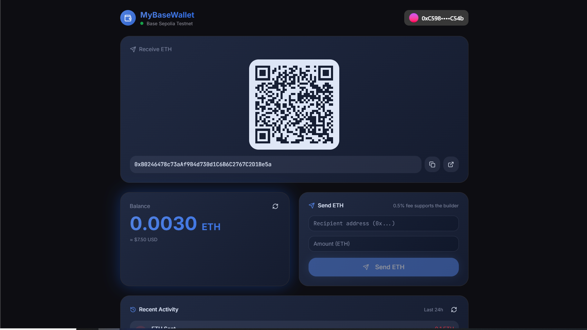
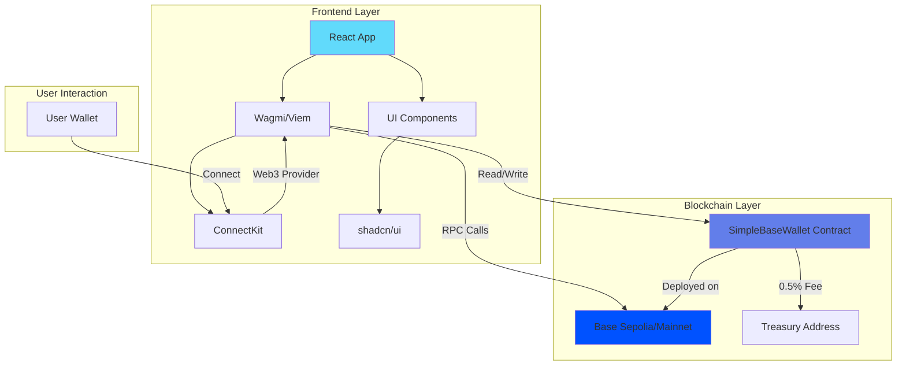
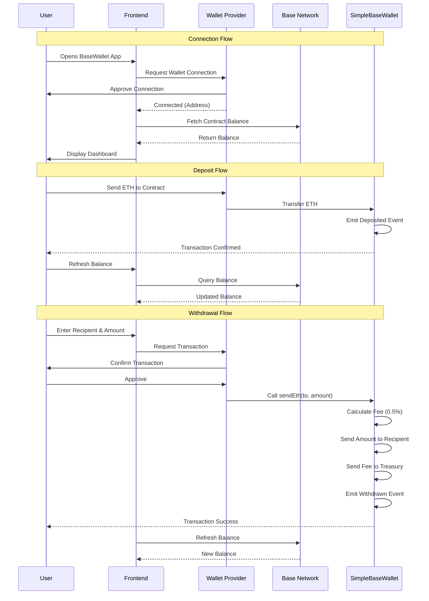
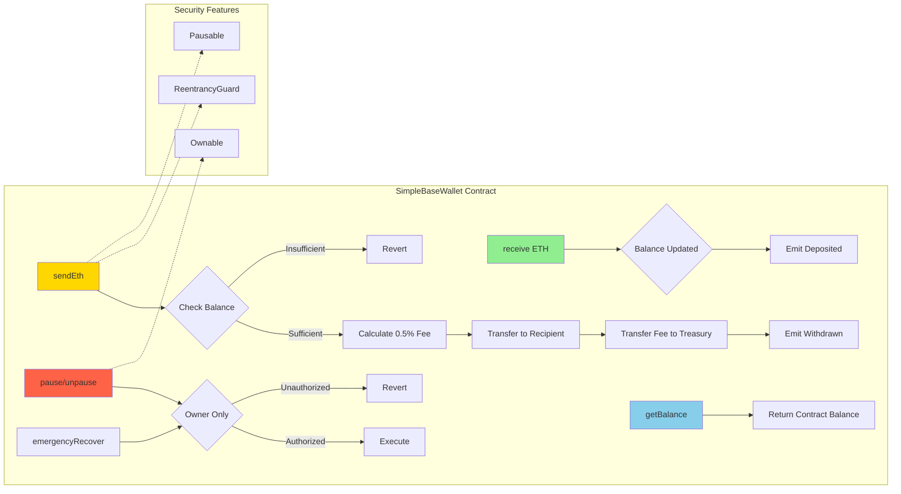

# BaseWallet


<div align="center">
  
</div>

## Description

**BaseWallet** is a comprehensive decentralized wallet application built on Base Layer 2 blockchain. It combines a secure Solidity smart contract with a modern React frontend, enabling users to send, receive, and manage ETH on Base Sepolia testnet and Base mainnet. The project features a 0.5% protocol fee mechanism that supports ongoing development while maintaining transparency and security through OpenZeppelin's battle-tested libraries.

### Key Features

- **Secure Smart Contract**: Built with OpenZeppelin's Ownable and Pausable patterns
- **Protocol Fee System**: 0.5% (50 BPS) fee on withdrawals to support ecosystem development
- **Modern UI/UX**: Sleek glass-morphism design with blue gradient theme
- **Multi-Wallet Support**: ConnectKit integration for MetaMask, WalletConnect, and more
- **Base Network**: Optimized for Base Sepolia (testnet) and Base Mainnet
- **Real-time Balance**: Live contract balance updates with manual refresh option
- **Responsive Design**: Mobile-first approach with PWA capabilities
- **Security First**: ReentrancyGuard, emergency recovery, and pausable operations

---

## Table of Contents

- [BaseWallet](#basewallet)
  - [Description](#description)
    - [Key Features](#key-features)
  - [Table of Contents](#table-of-contents)
  - [Architecture](#architecture)
  - [System Flow](#system-flow)
  - [Smart Contract Interaction](#smart-contract-interaction)
  - [Project Structure](#project-structure)
  - [Prerequisites](#prerequisites)
  - [Installation](#installation)
    - [1. Clone Repository](#1-clone-repository)
    - [2. Smart Contract Setup](#2-smart-contract-setup)
    - [3. Frontend Setup](#3-frontend-setup)
  - [Development](#development)
    - [Start Development Server](#start-development-server)
    - [Build for Production](#build-for-production)
    - [Preview Production Build](#preview-production-build)
    - [Lint Code](#lint-code)
  - [Deployment](#deployment)
    - [Smart Contract Deployment](#smart-contract-deployment)
      - [Deploy to Base Sepolia (Testnet)](#deploy-to-base-sepolia-testnet)
      - [Deploy to Base Mainnet](#deploy-to-base-mainnet)
    - [Frontend Deployment](#frontend-deployment)
  - [Smart Contract Details](#smart-contract-details)
    - [Contract Address](#contract-address)
    - [Key Functions](#key-functions)
    - [Events](#events)
    - [Security Features](#security-features)
  - [Frontend Technology Stack](#frontend-technology-stack)
  - [Environment Variables](#environment-variables)
  - [Contributing](#contributing)
    - [Development Guidelines](#development-guidelines)
    - [Reporting Issues](#reporting-issues)
  - [License](#license)
  - [Acknowledgments](#acknowledgments)
  - [Support](#support)

---

## Architecture



---

## System Flow



---

## Smart Contract Interaction



---

## Project Structure

```
basedWallet/
├── solidityContract/          # 👉 Smart Contract Directory
│   ├── src/
│   │   └── SimpleBaseWallet.sol
│   ├── script/
│   │   └── DeploySimpleWallet.s.sol
│   ├── test/
│   │   └── SimpleBaseWallet.t.sol
│   ├── lib/
│   │   ├── forge-std/
│   │   └── openzeppelin-contracts/
│   ├── foundry.toml
│   ├── deploy-testnet.sh
│   └── deploy-mainnet.sh
├── src/                       # Frontend Source
│   ├── components/
│   │   ├── ui/               # shadcn/ui components
│   │   └── WalletDashboard.tsx
│   ├── config/
│   │   └── wagmi.ts          # Wagmi + ConnectKit config
│   ├── hooks/
│   ├── App.tsx
│   ├── main.tsx
│   └── index.css
├── assets/
│   └── wallet.png
├── public/
├── contract.ps1              # Contract deployment script
├── package.json
├── vite.config.ts
├── tsconfig.json
├── tailwind.config.ts
├── .gitignore
└── README.md
```

> 📌 **Smart Contract Details**: Navigate to [`solidityContract/`](./solidityContract/) for comprehensive contract documentation, deployment guides, and testing instructions.

---

## Prerequisites

Before you begin, ensure you have the following installed:

- **Node.js** >= 18.x ([Download](https://nodejs.org/))
- **pnpm** >= 8.x (or npm/yarn)
  ```bash
  npm install -g pnpm
  ```
- **Foundry** (for smart contract development)
  ```bash
  curl -L https://foundry.paradigm.xyz | bash
  foundryup
  ```
- **Git**
- **MetaMask** or compatible Web3 wallet

---

## Installation

### 1. Clone Repository

```bash
git clone <your-repo-url>
cd basedWallet
```

### 2. Smart Contract Setup

Navigate to the smart contract directory:

```bash
cd solidityContract
```

Install dependencies:

```bash
forge install
```

Build contracts:

```bash
forge build
```

Run tests:

```bash
forge test
forge test -vvv  # Verbose output
```

### 3. Frontend Setup

Return to root directory:

```bash
cd ..
```

Install frontend dependencies:

```bash
pnpm install
```

---

## Development

### Start Development Server

```bash
pnpm dev
```

The app will be available at `http://localhost:8080`

### Build for Production

```bash
pnpm build
```

### Preview Production Build

```bash
pnpm preview
```

### Lint Code

```bash
pnpm lint
```

---

## Deployment

### Smart Contract Deployment

#### Deploy to Base Sepolia (Testnet)

```bash
cd solidityContract
./deploy-testnet.sh
```

Or manually:

```bash
forge script script/DeploySimpleWallet.s.sol:DeploySimpleWallet \
  --rpc-url https://sepolia.base.org \
  --broadcast \
  --verify
```

#### Deploy to Base Mainnet

```bash
./deploy-mainnet.sh
```

Or manually:

```bash
forge script script/DeploySimpleWallet.s.sol:DeploySimpleWallet \
  --rpc-url https://mainnet.base.org \
  --broadcast \
  --verify
```

> ⚠️ **Important**: Update the contract address in `src/config/wagmi.ts` after deployment.

### Frontend Deployment

The frontend can be deployed to any static hosting service:

**Vercel:**
```bash
vercel
```

**Netlify:**
```bash
netlify deploy --prod
```

**Build and deploy manually:**
```bash
pnpm build
# Upload the 'dist' folder to your hosting service
```

---

## Smart Contract Details

### Contract Address

- **Base Sepolia**: `0xB0246478c73aAf9B4d730d1C6B6C2767C2D1Be5a`
- **Base Mainnet**: TBD

### Key Functions

| Function | Description | Access |
|----------|-------------|--------|
| `receive()` | Accept ETH deposits | Public |
| `sendEth(to, amount)` | Send ETH with 0.5% fee | Owner |
| `getBalance()` | Get contract balance | Public |
| `pause()` | Pause contract operations | Owner |
| `unpause()` | Resume contract operations | Owner |
| `emergencyRecover(to)` | Emergency fund recovery | Owner |

### Events

- `Deposited(address from, uint256 amount)`
- `Withdrawn(address owner, address to, uint256 amountSent, uint256 fee)`
- `EmergencyRecovered(address to, uint256 amount)`

### Security Features

- ✅ **OpenZeppelin Ownable**: Owner-only administrative functions
- ✅ **ReentrancyGuard**: Protection against reentrancy attacks
- ✅ **Pausable**: Emergency pause mechanism
- ✅ **Event Logging**: Complete transaction transparency
- ✅ **Protocol Fee**: Sustainable 0.5% withdrawal fee

---

## Frontend Technology Stack

| Technology | Version | Purpose |
|------------|---------|---------|
| React | 19.2.3 | UI Framework |
| TypeScript | 5.8.3 | Type Safety |
| Vite | 5.4.19 | Build Tool |
| Wagmi | 3.1.3 | Ethereum React Hooks |
| Viem | 2.43.3 | Ethereum Utilities |
| ConnectKit | 1.9.1 | Wallet Connection UI |
| TanStack Query | 5.83.0 | Data Fetching |
| Tailwind CSS | 3.4.17 | Styling |
| shadcn/ui | Latest | UI Components |
| Radix UI | Latest | Headless UI Primitives |

---

## Environment Variables

Create a `.env` file in the `solidityContract/` directory:

```env
# RPC URLs
BASE_SEPOLIA_RPC=https://sepolia.base.org
BASE_MAINNET_RPC=https://mainnet.base.org

# Private Key (NEVER commit this!)
PRIVATE_KEY=your_private_key_here

# Block Explorer API Keys
BASESCAN_API_KEY=your_basescan_api_key

# Treasury Address
TREASURY_ADDRESS=0x...
```

> ⚠️ **Security Warning**: Never commit `.env` files or expose private keys!

---

## Contributing

Contributions are welcome! Please follow these steps:

1. **Fork** the repository
2. **Create** a feature branch (`git checkout -b feature/amazing-feature`)
3. **Commit** your changes (`git commit -m 'Add amazing feature'`)
4. **Push** to the branch (`git push origin feature/amazing-feature`)
5. **Open** a Pull Request

### Development Guidelines

- Follow the existing code style
- Write tests for new features
- Update documentation as needed
- Ensure all tests pass before submitting PR
- Use conventional commit messages

### Reporting Issues

Found a bug? Have a suggestion? Please [open an issue](../../issues) with:
- Clear description
- Steps to reproduce (for bugs)
- Expected vs actual behavior
- Screenshots (if applicable)

---

## License

This project is licensed under the **MIT License** - see the [LICENSE](LICENSE) file for details.

---

## Acknowledgments

- **Base** - Layer 2 blockchain platform
- **OpenZeppelin** - Secure smart contract libraries
- **Foundry** - Ethereum development toolchain
- **Wagmi** - React hooks for Ethereum
- **ConnectKit** - Beautiful wallet connection UI
- **shadcn/ui** - Beautifully designed components

---

## Support

- **Documentation**: [Base Docs](https://docs.base.org/)
- **Foundry Book**: [Foundry Documentation](https://book.getfoundry.sh/)
- **Wagmi Docs**: [Wagmi Documentation](https://wagmi.sh/)
- **Base Block Explorer**: [BaseScan](https://basescan.org/)

---

<div align="center">
  <p>Built on Base Layer 2</p>
  <p><i>Every transaction → 0.5% fee supports the builder</i></p>
</div>